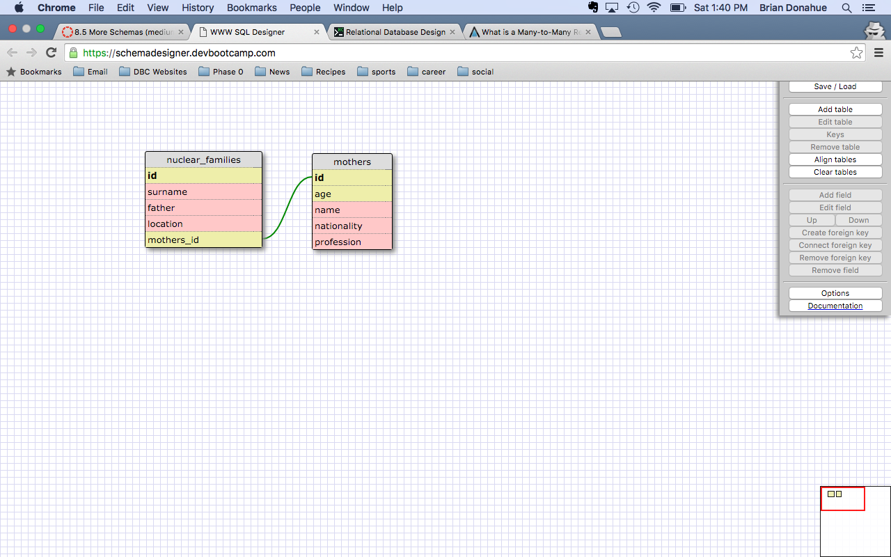
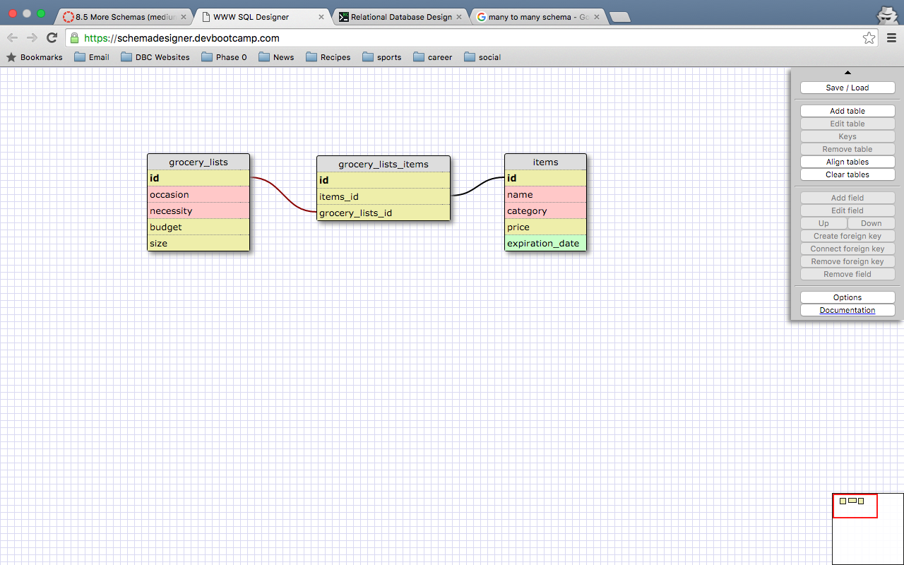

##Release 2

The relationship represented above is one to one because, for a given child in a nuclear family, there is only one mother. Like all one to one relationships, I could have simply created a field for mother_name in the child table rather than making an entriely seperate table. Also, this accounts for the mother field being null. If the child's biological mother is not involved in family life, the mother field could be left empty. I could have specified this field a bit more with present_mother and present_father if I had desired.

##Release 4

##Release 6
What is a one-to-one database?
In a one-to-one database, each row in one database table is linked to 1 and only 1 other row in another table. The foreign key in a one-to-one database is optional, meaning it can be left empty as null. There can only be one instance of the extended key in a one-to-one database.

When would you use a one-to-one database? (Think generally, not in terms of the example you created).
You use a one-to-one database to account for the possibility of a column being left empty. The explanation of capital cities in this challenge is a great example. For a period of time, countries may or may not have had a capital, so a one-to-one relationship does a great job of accounting for the possible empty column in a hypothetical database.

What is a many-to-many database?
In a many-to-many database, one or more rows in a table can be related to 0, 1 or many rows in another table.

When would you use a many-to-many database? (Think generally, not in terms of the example you created).
You would implement a many-to-many database when there is a relationship between a parent row in one table containing several child rows in the second table, and vice versa. For instance, if we had two tables, books and authors, we would use a many-to-many database. An author can write 0,1 or many books, while a book can be written by 1 or more authors.

What is confusing about database schemas? What makes sense?
The relationships between the tables in each database relationship make logical sense. It's just sometimes difficult to remember how they relate to one another in different examples. It makes sense though to implement these different database types in order to keep information orderly and DRY.
