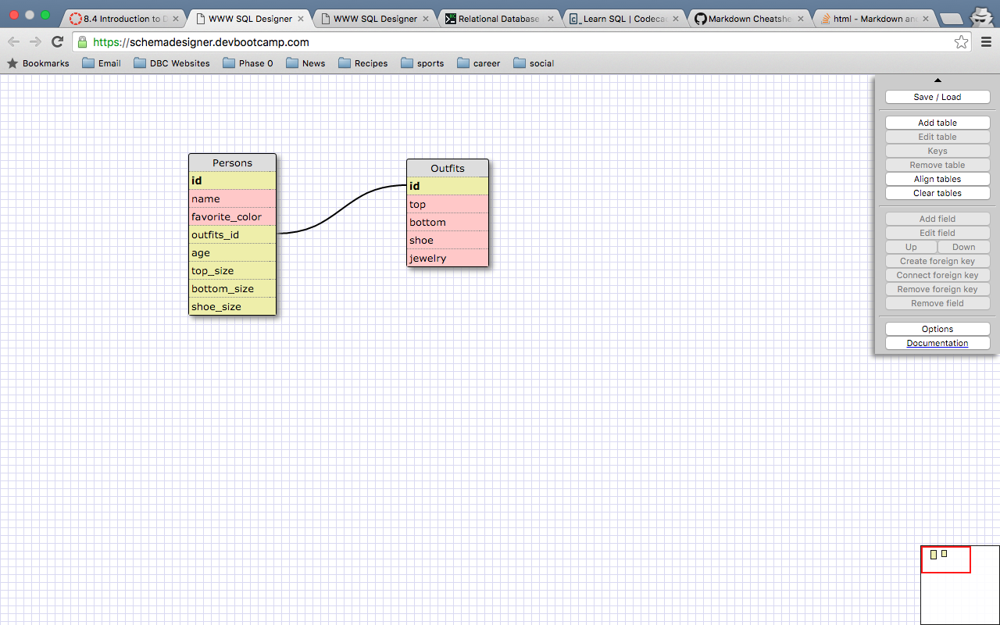

##Release 5
<!-- #1 -->
1.) SELECT  * FROM states;
<!-- #2 -->
2.)SELECT * FROM regions;
<!-- #3 -->
3.)SELECT state_name,population FROM states;
<!-- 4 -->
4.)SELECT state_name, population FROM states
ORDER BY population DESC;
<!-- 5 -->
5.)SELECT state_name FROM states WHERE region_id == 7;
<!-- 6 -->
6.)SELECT state_name, population_density FROM states WHERE population_density > 50
ORDER BY population_density ASC;
<!-- 7 -->
7.)SELECT state_name FROM states WHERE population > 1000000 AND population <1500000;
<!-- 8 -->
8.)SELECT state_name, region_id FROM states
ORDER BY region_id ASC;
<!-- 9 -->
9.)SELECT region_name FROM regions WHERE region_name LIKE '%central%';
<!-- 10 - Return to -->
10.)SELECT region_name, state_name FROM regions INNER JOIN states ORDER BY region_id ASC;

##Release 6 - Schema Design
<<<<<<< HEAD

=======

>>>>>>> 39f4f5cca19d5e9df33eb878646e90625ccea03f

##Reflection

What are databases for?
<<<<<<< HEAD
Databases are storage containers for data information and allow info to easily be accessed, managed and updated. They hold information and allow developers to query information using SQL. It is imperative that information is not repeated within databases, so they often provide constraints for data input.

What is a one-to-many relationship?
When one form of data has a relationship to another form and "belongs" to that other form, it is a one-to-many relationship. If you can fill in the statement "__ belongs to a __," the relationship of the first blank to the second is one to many.  For example, Wisconsin only belongs to the East North Central Region. The East North Central Region has many states. Because these two things have a one-to-many relationship, it makes far more sense to separate them into two tables.

What is a primary key? What is a foreign key? How can you determine which is which?
A primary key, also called a primary keyword, is a key in a relational database that is unique for each record. It is a unique identifier, such as a driver license number, telephone number (including area code), or vehicle identification number (VIN). A relational database must always have one and only one primary key. Primary keys typically appear as columns in relational database tables.
A foreign key is a field in one table that uniquely identifies a row of another table. The foreign key is defined in a second table, but it refers to the primary key in the first table. For instance, a table called "Employee" has a primary key called "employee_id". Another table called "Employee Details" has a foreign key which references "employee_id" in order to uniquely identify the relationship between both the tables.

How can you select information out of a SQL database? What are some general guidelines for that?
There is a list of commands in SQL that enable someone to select information from a database. SELECT is the primary command that allows for specifications. From there, a developer can adjust their search using other commands and oeprators, like ORDER BY, ASC, DESC, <, >, =, etc.
=======

Databases are storage containers for data information and allow info to easily be accessed, managed and updated. They hold information and allow developers to query information using SQL. It is imperative that information is not repeated within databases, so they often provide constraints for data input.

What is a one-to-many relationship?

When one form of data has a relationship to another form and "belongs" to that other form, it is a one-to-many relationship. If you can fill in the statement "__ belongs to a __," the relationship of the first blank to the second is one to many.  For example, Wisconsin only belongs to the East North Central Region. The East North Central Region has many states. Because these two things have a one-to-many relationship, it makes far more sense to separate them into two tables.

What is a primary key? What is a foreign key? How can you determine which is which?

A primary key, also called a primary keyword, is a key in a relational database that is unique for each record. It is a unique identifier, such as a driver license number, telephone number (including area code), or vehicle identification number (VIN). A relational database must always have one and only one primary key. Primary keys typically appear as columns in relational database tables.
A foreign key is a field in one table that uniquely identifies a row of another table. The foreign key is defined in a second table, but it refers to the primary key in the first table. For instance, a table called "Employee" has a primary key called "employee_id". Another table called "Employee Details" has a foreign key which references "employee_id" in order to uniquely identify the relationship between both the tables.

How can you select information out of a SQL database? What are some general guidelines for that?

There is a list of commands in SQL that enable someone to select information from a database. SELECT is the primary command that allows for specifications. From there, a developer can adjust their search using other commands and oeprators, like ORDER BY, ASC, DESC, <, >, =, etc.
>>>>>>> 39f4f5cca19d5e9df33eb878646e90625ccea03f
